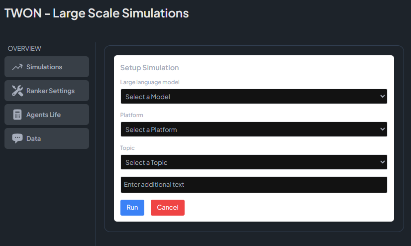
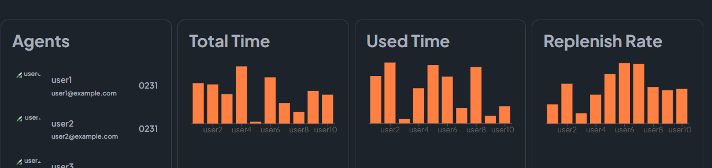
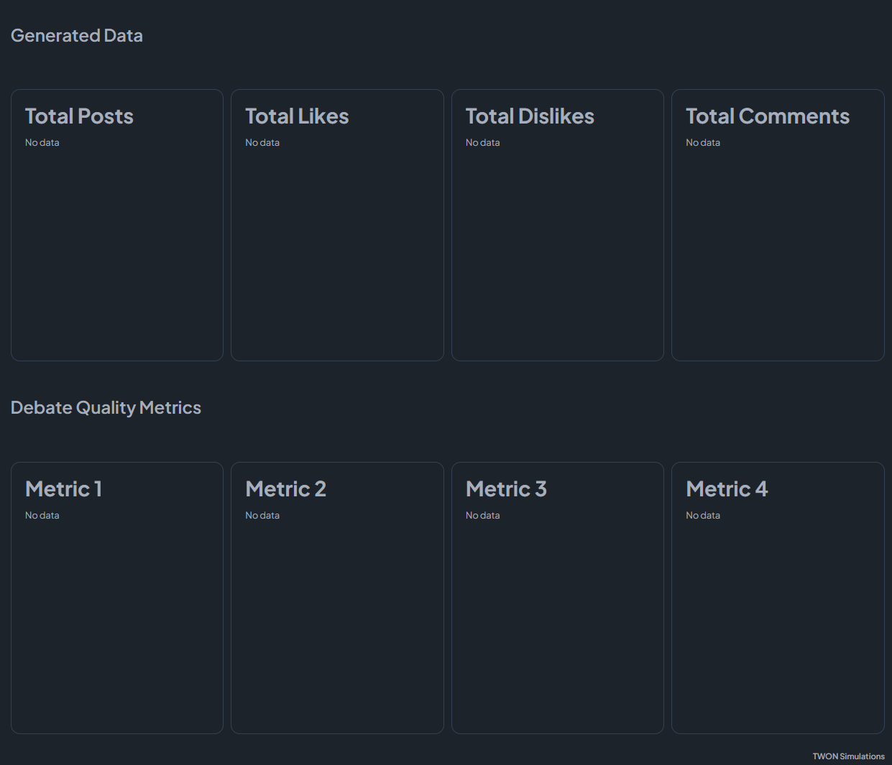

# TWON - Large Scale Simulations

A TypeScript application for running and analyzing large-scale social media simulations using LLM agents. This platform enables researchers and developers to study agent behaviors, interaction patterns, and emergent phenomena in controlled social media environments.

## 🌟 Features

- **Multi-Agent Simulation**: Setup and run simulations with multiple LLM agents interacting in a social media environment
- **Flexible Configuration**: Choose different language models, platforms, and topics for your simulations
- **Agent Lifecycle Management**: Monitor and manage agent states, interactions, and resource usage
- **Real-Time Analytics**: Track key metrics including:
  - Total Time & Used Time per agent
  - Replenish Rates
  - Interaction metrics (Posts, Likes, Dislikes, Comments)
  - Custom Debate Quality Metrics
- **Dark Mode Interface**: Clean, modern UI with dark mode for better visibility

## 🚀 Getting Started

### Prerequisites

- Node.js (v16 or higher)
- npm or yarn
- TypeScript 4.x

### Installation

1. Clone the repository:
```bash
git clone https://github.com/abdulsittar/TWON_Simulations.git
cd TWON_Simulations
```

2. Set up your environment variables in the .env file that you will create dircetly in the TWON_Simulations repository:
```bash
NODE_ENV=
MONGO_URI=
JWT_SECRET=
PORT=
```

## 🏗️ Project Structure
Project is divided into two parts: frontend and backend. Frontend generates user interface, while the backend runs the suimulations and saves the data. The simplified tree structure is given here:
```
twon-simulations/
├── backend
│   ├── Dockerfile
│   ├── jest.config.js
│   ├── package.json
│   ├── package-lock.json
│   ├── src
│   │   ├── app.ts
│   │   ├── config/
│   │   ├── controllers/
│   │   ├── index.ts
│   │   ├── models
│   │   │   ├── content/
│   │   │   ├── network.ts
│   │   │   ├── platform/
│   │   │   ├── shared/
│   │   │   └── user/
│   │   ├── routes/
│   │   ├── server.ts
│   │   ├── services/
│   │   └── utils/
│   ├── tsconfig.json
│   └── vercel.json
├── docker-compose.yml
├── frontend
│   ├── Dockerfile
│   ├── index.html
│   ├── package.json
│   ├── package-lock.json
│   ├── postcss.config.js
│   ├── public/
│   ├── src
│   │   ├── api/
│   │   ├── App.tsx
│   │   ├── components
│   │   │   ├── ChangesThemes.tsx
│   │   │   ├── charts/
│   │   │   ├── DataTable.tsx
│   │   │   ├── Footer.tsx
│   │   │   ├── menu/
│   │   │   ├── Navbar.tsx
│   │   │   ├── ToasterProvider.tsx
│   │   │   └── topDealsBox/
│   │   ├── contexts/
│   │   ├── index.css
│   │   ├── main.tsx
│   │   ├── pages/
│   │   └── vite-env.d.ts
│   ├── tailwind.config.js
│   ├── tsconfig.json
│   ├── tsconfig.node.json
│   ├── vercel.json
│   └── vite.config.ts
├── LICENSE
└── README.md
```

## 🎮 Usage

1. Build and start the server:
```bash
#run this command in the terminal:
podman-compose up --build
```
2. Access the application at the link that pops up after the app had successfully run.

### Running a Simulation

1. The app will open directly to the simulation page

2. Configure your simulation parameters:
   - Select a language model
   - Choose the platform to run it on
   - Define the simulation topic
   - Add any additional parameters
4. Click "Run" to start the simulation

## 📊 Metrics and Analysis

The platform provides several key metrics for analysis:


- **Agent Lifecycle**: Monitor agent activity and resource usage
- **Generated Data**: Track social interactions (posts, likes, dislikes, comments)
- **Debate Quality**: Analyze interaction quality through custom metrics
- **Time Usage**: Monitor total and used time for each agent

## 📝 License

This project is licensed under the MIT License - see the [LICENSE](LICENSE) file for details.

## 🙏 Acknowledgments

- Thanks to all contributors who participate in this project
- Built with TypeScript and React
- Powered by large language models for agent simulation

---

For more information or support, please open an issue on the GitHub repository.